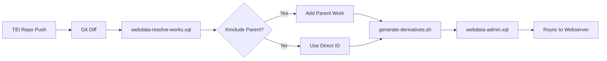

# SvSal Podman Quadlet Deployment Guide

This directory contains Podman Quadlet configuration files for deploying the SvSal (School of Salamanca) application stack in production environments, as well as instructions for CI/CD derivative file generation workflows.

## Table of Contents

- [Overview](#overview)
- [Production Deployment (Quadlet)](#production-deployment-quadlet)
  - [Prerequisites](#prerequisites)
  - [Installation](#installation)
  - [Managing Services](#managing-services)
  - [AutoUpdate Configuration](#autoupdate-configuration)
- [CI/CD Deployment (Docker Compose)](#cicd-deployment-docker-compose)
  - [Purpose](#purpose)
  - [Usage](#usage)
  - [Required Environment Variables](#required-environment-variables)
  - [Automated Generation from TEI Repository](#automated-generation-from-tei-repository)
  - [Example Workflow](#example-workflow)
- [Network Aliases Configuration](#network-aliases-configuration)
- [Secrets Management](#secrets-management)
- [Image Building](#image-building)
- [Volume Management](#volume-management)
- [Troubleshooting](#troubleshooting)

## Overview

The SvSal stack consists of four main services:

- **existdb**: eXist-db XML database
- **caddy**: Web server and reverse proxy
- **sphinxsearch**: Full-text search engine
- **any23**: RDF extraction service

### Architecture

- All services run in a single Podman pod (`svsal-pod`)
- Named volumes for persistent data
- Systemd integration for automatic startup and management
- Pre-built container images from GitHub Container Registry (ghcr.io)

## Production Deployment (Quadlet)

### Prerequisites

1. **Podman** installed (version 4.4 or later recommended)
   ```bash
   # On Fedora/RHEL/CentOS
   sudo dnf install podman
   
   # On Ubuntu/Debian
   sudo apt install podman
   ```

2. **Systemd user service** enabled
   ```bash
   # Enable lingering to allow user services to run without active session
   sudo loginctl enable-linger $USER
   ```

3. **Quadlet directory** created
   ```bash
   mkdir -p ~/.config/containers/systemd
   ```

### Installation

1. **Copy Quadlet files** to the systemd user directory:
   ```bash
   cp *.container *.pod *.volume *.network ~/.config/containers/systemd/
   ```

2. **Reload systemd** to recognize the new units:
   ```bash
   systemctl --user daemon-reload
   ```

3. **Start the pod** and all services:
   ```bash
   # Start the pod (this will start all containers in the pod)
   systemctl --user start svsal.pod
   
   # Enable automatic startup on boot
   systemctl --user enable svsal.pod
   ```

   Alternatively, you can start individual services:
   ```bash
   systemctl --user start existdb.service
   systemctl --user start caddy.service
   systemctl --user start sphinxsearch.service
   systemctl --user start any23.service
   ```

### Managing Services

**Check service status:**
```bash
# Pod status
systemctl --user status svsal.pod

# Individual service status
systemctl --user status existdb.service
systemctl --user status caddy.service
systemctl --user status sphinxsearch.service
systemctl --user status any23.service

# Podman pod overview
podman pod ps

# Container details
podman ps -a
```

**Stop services:**
```bash
# Stop the entire pod
systemctl --user stop svsal.pod

# Or stop individual services
systemctl --user stop caddy.service
```

**Restart services:**
```bash
systemctl --user restart existdb.service
```

**View logs:**
```bash
# Service logs via journalctl
journalctl --user -u existdb.service -f

# Or directly via Podman
podman logs -f existdb
```

### AutoUpdate Configuration

By default, AutoUpdate is **commented out** in all container files to ensure manual control over updates. This prevents unexpected changes in production.

**To enable automatic updates:**

1. Edit the container file (e.g., `~/.config/containers/systemd/existdb.container`)
2. Uncomment the line: `# AutoUpdate=registry` → `AutoUpdate=registry`
3. Reload systemd: `systemctl --user daemon-reload`
4. Set up a systemd timer or cron job to run:
   ```bash
   podman auto-update
   systemctl --user restart existdb.service  # Restart services that were updated
   ```

**Manual updates** (recommended for production):
```bash
# Pull latest image
podman pull ghcr.io/digicademy/svsal/svsal-exist:3.0rc1

# Restart service to use new image
systemctl --user restart existdb.service
```

## CI/CD Deployment (Docker Compose)

### Purpose

The `docker-compose.cicd.yml` file provides a **lightweight configuration** specifically designed for CI/CD pipelines. It includes only the services needed for derivative file generation:

- **existdb**: For running XQuery scripts (e.g., `webdata-admin.xql`) to generate derivatives
- **any23**: For RDF extraction from TEI/XML files

This configuration has a reduced memory footprint and does not include caddy or sphinxsearch, which are not needed during the build/generation phase.

### Usage

```bash
# Start services
docker-compose -f docker/docker-compose.cicd.yml up -d

# Wait for services to be ready
sleep 10

# Run your derivative generation scripts
# Example: Call webdata-admin.xql via HTTP
curl -X POST http://localhost:8080/exist/apps/your-app/webdata-admin.xql

# Or use eXist-db client tools
# java -jar start.jar client -u admin -P $EXISTDB_ADMIN_PASSWORD ...

# Stop services
docker-compose -f docker/docker-compose.cicd.yml down
```

### Required Environment Variables

The following environment variables should be configured in your CI/CD platform (GitHub Actions, GitLab CI, Jenkins, etc.):

| Variable | Description | Required |
|----------|-------------|----------|
| `EXISTDB_ADMIN_PASSWORD` | Admin password for eXist-db | Yes |
| `SSH_PRIVATE_KEY` | SSH private key for rsync to webserver | Optional* |
| `WEBSERVER_HOST` | Target webserver hostname | Optional* |
| `WEBSERVER_USER` | SSH user for webserver | Optional* |

\* Required only if using rsync to deploy generated files to a remote webserver

**Important**: Never commit secrets to the repository. Use your CI/CD platform's secret management features.

#### Platform-Specific Configuration Examples

**GitHub Actions:**
```yaml
env:
  EXISTDB_ADMIN_PASSWORD: ${{ secrets.EXISTDB_ADMIN_PASSWORD }}
  SSH_PRIVATE_KEY: ${{ secrets.SSH_PRIVATE_KEY }}
  WEBSERVER_HOST: ${{ secrets.WEBSERVER_HOST }}
  WEBSERVER_USER: ${{ secrets.WEBSERVER_USER }}
```

**GitLab CI:**
```yaml
variables:
  EXISTDB_ADMIN_PASSWORD: $EXISTDB_ADMIN_PASSWORD
  SSH_PRIVATE_KEY: $SSH_PRIVATE_KEY
  WEBSERVER_HOST: $WEBSERVER_HOST
  WEBSERVER_USER: $WEBSERVER_USER
```

**Jenkins:**
```groovy
environment {
    EXISTDB_ADMIN_PASSWORD = credentials('existdb-admin-password')
    SSH_PRIVATE_KEY = credentials('ssh-private-key')
    WEBSERVER_HOST = credentials('webserver-host')
    WEBSERVER_USER = credentials('webserver-user')
}
```

### Automated Generation from TEI Repository

#### Architecture Overview

When TEI XML source files are updated in a separate repository, the CI/CD workflow:

1. **Detects changed files** via `git diff`
2. **Resolves work IDs** including XInclude parents (multivolume works)
3. **Generates derivatives** (HTML, TXT, PDF, RDF, IIIF)
4. **Deploys to webserver** via rsync



#### XInclude Resolution Example

**Scenario:** User updates `works/W0066_Vol_02.xml`

**Parent Work TEI Structure (W0066.xml):**
```xml
<TEI xmlns="http://www.tei-c.org/ns/1.0" 
     xmlns:xi="http://www.w3.org/2001/XInclude" 
     xml:id="W0066">
  <teiHeader>
    <fileDesc>
      <titleStmt>
        <title>Multivolume Work Example</title>
      </titleStmt>
    </fileDesc>
  </teiHeader>
  <text type="work_multivolume">
    <group>
      <xi:include href="W0066_Vol_01.xml"/>
      <xi:include href="W0066_Vol_02.xml"/>
      <xi:include href="W0066_Vol_03.xml"/>
    </group>
  </text>
</TEI>
```

**Resolution Process:**
1. Git detects: `works/W0066_Vol_02.xml`
2. `webdata-resolve-works.xql` finds:
   - Direct ID: `W0066_Vol_02` (extracted from filename)
   - Parent work: `W0066` (found by searching for `<xi:include href="W0066_Vol_02.xml"/>`)
3. Generates derivatives for: **`W0066`** (the multivolume parent)

**API Call Example:**
```bash
curl "http://localhost:8080/exist/apps/salamanca/webdata-resolve-works.xql" \
  --data-urlencode "files=works/W0066_Vol_02.xml" \
  --data-urlencode "format=json"
```

**Response:**
```json
{
  "works": ["W0066"],
  "resolved": {
    "works/W0066_Vol_02.xml": ["W0066"]
  },
  "count": 1
}
```

Note: When a volume is updated, the entire parent work is regenerated to ensure consistency across all volumes.

#### TEI Repository CI/CD Configuration

Create `.github/workflows/generate-derivatives.yml` in your TEI repository:

```yaml
name: Generate Derivatives

on:
  push:
    branches: [main]
    paths:
      - 'works/**/*.xml'
      - 'lemmata/**/*.xml'

jobs:
  generate:
    runs-on: ubuntu-latest
    
    steps:
      - name: Checkout TEI repository
        uses: actions/checkout@v4
        with:
          fetch-depth: 2
      
      - name: Detect changed TEI files
        id: changes
        run: |
          CHANGED=$(git diff --name-only HEAD^..HEAD | \
            grep '\.xml$' | \
            tr '\n' ',' | \
            sed 's/,$//')
          echo "files=$CHANGED" >> $GITHUB_OUTPUT
          echo "Changed files: $CHANGED"
      
      - name: Checkout svsal infrastructure
        uses: actions/checkout@v4
        with:
          repository: digicademy/svsal
          path: svsal
          token: ${{ secrets.GITHUB_TOKEN }}
      
      - name: Start generation services
        working-directory: svsal/docker
        run: |
          # Start existdb and any23
          docker-compose -f docker-compose.cicd.yml up -d
          
          # Wait for services to be ready
          timeout 300 bash -c "until curl -sf http://localhost:8080 >/dev/null 2>&1; do sleep 5; done"
          
          # Mount TEI source files into existdb
          docker cp $GITHUB_WORKSPACE/. \
            existdb-cicd:/exist/apps/salamanca-tei/
      
      - name: Generate derivatives
        working-directory: svsal/docker/scripts
        env:
          CHANGED_FILES: ${{ steps.changes.outputs.files }}
          EXISTDB_PASSWORD: ${{ secrets.EXISTDB_PASSWORD }}
          EXISTDB_URL: http://localhost:8080
        run: |
          chmod +x generate-derivatives.sh
          ./generate-derivatives.sh
      
      - name: Rsync to webserver
        env:
          SSH_KEY: ${{ secrets.SSH_PRIVATE_KEY }}
          WEBSERVER_HOST: ${{ secrets.WEBSERVER_HOST }}
          WEBSERVER_USER: ${{ secrets.WEBSERVER_USER }}
        run: |
          # Setup SSH
          mkdir -p ~/.ssh
          echo "$SSH_KEY" > ~/.ssh/id_rsa
          chmod 600 ~/.ssh/id_rsa
          
          # Get export volume path
          EXPORT_PATH=$(docker volume inspect existexport-cicd \
            --format '{{ .Mountpoint }}')
          
          # Rsync to webserver
          rsync -avz --delete \
            -e "ssh -o StrictHostKeyChecking=no" \
            "$EXPORT_PATH/" \
            "$WEBSERVER_USER@$WEBSERVER_HOST:/var/www/salamanca/webdata/"
      
      - name: Cleanup
        if: always()
        working-directory: svsal/docker
        run: docker-compose -f docker-compose.cicd.yml down -v
```

#### Required Secrets

Configure in TEI repository Settings → Secrets:

- **`EXISTDB_PASSWORD`** - Admin password for eXist-db
- **`SSH_PRIVATE_KEY`** - SSH key for rsync to webserver
- **`WEBSERVER_HOST`** - Target server hostname
- **`WEBSERVER_USER`** - SSH username

#### API Reference

**`webdata-resolve-works.xql`** - Resolves file paths to work IDs

Parameters:
- `files` - Comma-separated file paths
- `format` - `json` (default) or `csv`

Example:
```bash
curl "http://localhost:8080/exist/apps/salamanca/webdata-resolve-works.xql" \
  --data-urlencode "files=works/W0066_Vol_02.xml,works/W0013.xml" \
  --data-urlencode "format=json"
```

Response:
```json
{
  "works": ["W0066", "W0013"],
  "resolved": {
    "works/W0066_Vol_02.xml": ["W0066"],
    "works/W0013.xml": ["W0013"]
  },
  "count": 2
}
```

**`webdata-admin.xql` (Enhanced)** - Batch derivative generation

New Parameters:
- `wid` - Comma-separated work IDs or `"all"`
- `batch` - `true` for JSON output, `false` (default) for HTML
- `format` - Format to generate (html, txt, pdf, rdf, iiif, index, crumbtrails, details, snippets, nlp, routing, all)

Example:
```bash
curl -u "admin:password" \
  "http://localhost:8080/exist/apps/salamanca/webdata-admin.xql" \
  --data-urlencode "wid=W0066,W0013" \
  --data-urlencode "batch=true" \
  --data-urlencode "format=all"
```

Response (HTTP 200/207/500):
```json
{
  "results": [
    {"work": "W0066", "status": "success", "format": "all"},
    {"work": "W0013", "status": "success", "format": "all"}
  ],
  "total": 2,
  "successful": 2,
  "failed": 0,
  "runtime": "5.23 minutes"
}
```

### Example Workflow

Here's a complete example of a CI/CD workflow that generates derivatives and deploys them:

```yaml
name: Generate Derivatives

on:
  push:
    branches: [main]
    paths:
      - 'works/**/*.xml'
      - 'lemmata/**/*.xml'

jobs:
  generate:
    runs-on: ubuntu-latest
    
    steps:
      - name: Checkout TEI repository
        uses: actions/checkout@v4
        with:
          fetch-depth: 2
      
      - name: Detect changed TEI files
        id: changes
        run: |
          CHANGED=$(git diff --name-only HEAD^..HEAD | \
            grep '\.xml$' | \
            tr '\n' ',' | \
            sed 's/,$//')
          echo "files=$CHANGED" >> $GITHUB_OUTPUT
          echo "Changed files: $CHANGED"
      
      - name: Checkout svsal infrastructure
        uses: actions/checkout@v4
        with:
          repository: digicademy/svsal
          path: svsal
          token: ${{ secrets.GITHUB_TOKEN }}
      
      - name: Start generation services
        working-directory: svsal/docker
        run: |
          # Start existdb and any23
          docker-compose -f docker-compose.cicd.yml up -d
          
          # Wait for services to be ready
          timeout 300 bash -c "until curl -sf http://localhost:8080 >/dev/null 2>&1; do sleep 5; done"
          
          # Mount TEI source files into existdb
          docker cp $GITHUB_WORKSPACE/. \
            existdb-cicd:/exist/apps/salamanca-tei/
      
      - name: Generate derivatives
        working-directory: svsal/docker/scripts
        env:
          CHANGED_FILES: ${{ steps.changes.outputs.files }}
          EXISTDB_PASSWORD: ${{ secrets.EXISTDB_PASSWORD }}
          EXISTDB_URL: http://localhost:8080
        run: |
          chmod +x generate-derivatives.sh
          ./generate-derivatives.sh
      
      - name: Rsync to webserver
        env:
          SSH_KEY: ${{ secrets.SSH_PRIVATE_KEY }}
          WEBSERVER_HOST: ${{ secrets.WEBSERVER_HOST }}
          WEBSERVER_USER: ${{ secrets.WEBSERVER_USER }}
        run: |
          # Setup SSH
          mkdir -p ~/.ssh
          echo "$SSH_KEY" > ~/.ssh/id_rsa
          chmod 600 ~/.ssh/id_rsa
          
          # Get export volume path
          EXPORT_PATH=$(docker volume inspect existexport-cicd \
            --format '{{ .Mountpoint }}')
          
          # Rsync to webserver
          rsync -avz --delete \
            -e "ssh -o StrictHostKeyChecking=no" \
            "$EXPORT_PATH/" \
            "$WEBSERVER_USER@$WEBSERVER_HOST:/var/www/salamanca/webdata/"
      
      - name: Cleanup
        if: always()
        working-directory: svsal/docker
        run: docker-compose -f docker-compose.cicd.yml down -v
```

### Required Secrets

Configure in TEI repository Settings → Secrets:

- **`EXISTDB_PASSWORD`** - Admin password for eXist-db
- **`SSH_PRIVATE_KEY`** - SSH key for rsync to webserver
- **`WEBSERVER_HOST`** - Target server hostname
- **`WEBSERVER_USER`** - SSH username

### Manual Testing

Test the resolution locally:

```bash
# 1. Start services
cd docker
docker-compose -f docker-compose.cicd.yml up -d

# 2. Wait for services to be ready
timeout 300 bash -c "until curl -sf http://localhost:8080 >/dev/null 2>&1; do sleep 5; done"

# 3. Mount TEI source
docker cp /path/to/tei-files/. existdb-cicd:/exist/apps/salamanca-tei/

# 4. Test work resolution
curl "http://localhost:8080/exist/apps/salamanca/webdata-resolve-works.xql?files=works/W0066_Vol_02.xml"
# Returns: {"works": ["W0066"], "resolved": {...}}

# 5. Generate derivatives
export EXISTDB_PASSWORD="your-password"
export CHANGED_FILES="works/W0066_Vol_02.xml,works/W0013.xml"
./scripts/generate-derivatives.sh
```

### API Reference

#### `webdata-resolve-works.xql`

Resolves file paths to work IDs.

**Parameters:**
- `files` - Comma-separated file paths
- `format` - `json` (default) or `csv`

**Example:**
```bash
curl "http://localhost:8080/exist/apps/salamanca/webdata-resolve-works.xql" \
  --data-urlencode "files=works/W0066_Vol_02.xml,works/W0013.xml" \
  --data-urlencode "format=json"
```

**Response:**
```json
{
  "works": ["W0066", "W0013"],
  "resolved": {
    "works/W0066_Vol_02.xml": ["W0066"],
    "works/W0013.xml": ["W0013"]
  },
  "count": 2
}
```

#### `webdata-admin.xql` (Enhanced)

**New Parameters:**
- `wid` - Comma-separated work IDs or `"all"`
- `batch` - `true` for JSON output, `false` (default) for HTML
- `format` - Format to generate (html, txt, pdf, rdf, iiif, index, crumbtrails, details, snippets, nlp, routing, all)

**Example:**
```bash
curl -u "admin:password" \
  "http://localhost:8080/exist/apps/salamanca/webdata-admin.xql" \
  --data-urlencode "wid=W0066,W0013" \
  --data-urlencode "batch=true" \
  --data-urlencode "format=all"
```

**Response (HTTP 200/207/500):**
```json
{
  "results": [
    {"work": "W0066", "status": "success", "format": "all"},
    {"work": "W0013", "status": "success", "format": "all"}
  ],
  "total": 2,
  "successful": 2,
  "failed": 0,
  "runtime": "5.23 minutes"
}
```

#### `webdata-batch.xql` (Alternative Endpoint)

Simplified endpoint for batch processing.

**Parameters:**
- `works` - Comma-separated work IDs or `"all"`
- `formats` - Comma-separated formats or `"all"`

**Example:**
```bash
curl -u "admin:password" \
  "http://localhost:8080/exist/apps/salamanca/webdata-batch.xql" \
  --data-urlencode "works=W0066,W0013" \
  --data-urlencode "formats=html,txt,pdf"
```

**Response:**
```json
{
  "results": [
    {
      "work": "W0066",
      "formats": [
        {"format": "html", "status": "success"},
        {"format": "txt", "status": "success"},
        {"format": "pdf", "status": "success"}
      ]
    },
    {
      "work": "W0013",
      "formats": [
        {"format": "html", "status": "success"},
        {"format": "txt", "status": "success"},
        {"format": "pdf", "status": "success"}
      ]
    }
  ],
  "summary": {
    "totalWorks": 2,
    "totalOperations": 6,
    "successful": 6,
    "failed": 0,
    "formats": ["html", "txt", "pdf"],
    "runtime": "3.45 minutes"
  },
  "timestamp": "2024-01-10T16:00:00Z"
}
```

### HTTP Status Codes

- **200** - All operations successful
- **207** - Multi-Status (some operations succeeded, some failed)
- **500** - All operations failed

### Troubleshooting

#### Work not resolved

Check if the work exists in the TEI collection:
```bash
curl "http://localhost:8080/exist/apps/salamanca/webdata-resolve-works.xql?files=works/W0066.xml"
```

#### Generation fails

Check logs in the container:
```bash
docker logs existdb-cicd
```

#### TEI files not found

Verify TEI files are mounted:
```bash
docker exec existdb-cicd ls -la /exist/apps/salamanca-tei/works/
```

### Performance Considerations

- **Index first**: Always generate the index before other formats (`format=index`)
- **Parallel processing**: Consider splitting large batches across multiple workflow runs
- **Timeout**: Increase `TIMEOUT` environment variable for large works (default: 600 seconds)
- **Memory**: Adjust eXist-db memory in docker-compose (`JAVA_TOOL_OPTIONS: '-Xmx4g -Xms2g'`)

### Security

- **Secrets**: Never commit passwords or SSH keys to the repository
- **Authentication**: Always use authentication for derivative generation endpoints
- **Network**: Use private networks in production (not exposed ports)
- **Volume permissions**: Mount TEI source as read-only (`:ro`)

```bash
#!/bin/bash
set -e

# 1. Start services
docker-compose -f docker/docker-compose.cicd.yml up -d

# 2. Wait for eXist-db to be ready
echo "Waiting for eXist-db to start..."
timeout 60 bash -c 'until curl -sf http://localhost:8080/exist/; do sleep 2; done'

# 3. Run derivative generation
echo "Generating derivatives..."
curl -X POST \
  -u admin:${EXISTDB_ADMIN_PASSWORD} \
  http://localhost:8080/exist/apps/svsal/webdata-admin.xql

# 4. Setup SSH for rsync (if needed)
if [ -n "$SSH_PRIVATE_KEY" ]; then
  mkdir -p ~/.ssh
  echo "$SSH_PRIVATE_KEY" > ~/.ssh/id_rsa
  chmod 600 ~/.ssh/id_rsa
  
  # Optional: Add known hosts
  # ssh-keyscan $WEBSERVER_HOST >> ~/.ssh/known_hosts
  # Or use: -o StrictHostKeyChecking=no (less secure)
fi

# 5. Get the export volume path
EXPORT_PATH=$(docker volume inspect existexport-cicd --format '{{ .Mountpoint }}')

# 6. Rsync generated files to webserver
if [ -n "$SSH_PRIVATE_KEY" ]; then
  echo "Deploying to webserver..."
  rsync -avz -e "ssh -o StrictHostKeyChecking=no" \
    $EXPORT_PATH/ \
    ${WEBSERVER_USER}@${WEBSERVER_HOST}:/var/www/salamanca/data/
fi

# 7. Cleanup
docker-compose -f docker/docker-compose.cicd.yml down
```

**SSH Known Hosts Notes:**
- `SSH_KNOWN_HOSTS` is optional
- For automated CI/CD, you can either:
  - Pre-populate known_hosts with `ssh-keyscan $WEBSERVER_HOST >> ~/.ssh/known_hosts`
  - Use `-o StrictHostKeyChecking=no` (less secure, but acceptable for CI/CD)
  - Store and use a `SSH_KNOWN_HOSTS` secret

## Network Aliases Configuration

**Important**: Podman pods do not natively support Docker Compose-style network aliases. The `docker-compose.yml` file includes network aliases for service discovery, but these require external configuration when using Quadlet.

### Required Hostnames

The following hostnames are used by the application:

- `www.salamanca.school` → Caddy (web interface)
- `id.salamanca.school` → Caddy (identifier service)
- `search.salamanca.school` → Sphinxsearch

### Solutions by Environment

#### Production Deployment (Recommended)

Configure **DNS records** at your DNS provider:

```dns
www.salamanca.school.      A      <your-server-ip>
id.salamanca.school.       A      <your-server-ip>
search.salamanca.school.   A      <your-server-ip>
```

Or use CNAME records if appropriate:
```dns
www.salamanca.school.      CNAME  your-server.example.com.
id.salamanca.school.       CNAME  your-server.example.com.
search.salamanca.school.   CNAME  your-server.example.com.
```

#### Development/Testing

Add entries to `/etc/hosts` (requires root):

```bash
sudo tee -a /etc/hosts <<EOF
127.0.0.1 www.salamanca.school
127.0.0.1 id.salamanca.school
127.0.0.1 search.salamanca.school
EOF
```

Or use the pod's IP address:
```bash
POD_IP=$(podman inspect svsal-pod | jq -r '.[0].NetworkSettings.Networks[].IPAddress')
sudo tee -a /etc/hosts <<EOF
$POD_IP www.salamanca.school
$POD_IP id.salamanca.school
$POD_IP search.salamanca.school
EOF
```

#### CI/CD Environment

When using `docker-compose.cicd.yml`, **container names are used directly** for service discovery. No additional configuration is needed:

- `http://existdb:8080`
- `http://any23:8082`

## Secrets Management

**Critical**: Never commit secrets or credentials to the repository.

### Production Secrets

For production Quadlet deployments, sensitive configuration should be managed using:

1. **Environment files**: Create a `.env` file (not in git):
   ```bash
   # ~/.config/containers/svsal.env
   EXISTDB_ADMIN_PASSWORD=your-secure-password
   ```
   
   Reference in container file:
   ```ini
   EnvironmentFile=%h/.config/containers/svsal.env
   ```

2. **Systemd credentials** (Podman 4.5+):
   ```bash
   systemctl --user set-environment EXISTDB_ADMIN_PASSWORD='your-password'
   ```

3. **Secrets mounting** (for files):
   ```ini
   Secret=existdb-password,type=env,target=EXISTDB_PASSWORD
   ```

### CI/CD Secrets

Use your CI/CD platform's built-in secret management:

- **GitHub Actions**: Repository Secrets
- **GitLab CI**: CI/CD Variables (masked and protected)
- **Jenkins**: Credentials Plugin
- **Azure Pipelines**: Variable Groups (secret variables)

### Required Secrets List

| Secret | Purpose | Environment |
|--------|---------|-------------|
| `EXISTDB_ADMIN_PASSWORD` | eXist-db admin password | Production, CI/CD |
| `SSH_PRIVATE_KEY` | Deploy to webserver | CI/CD only |
| `WEBSERVER_HOST` | Target webserver hostname | CI/CD only |
| `WEBSERVER_USER` | SSH username for deployment | CI/CD only |

## Image Building

All services use **pre-built container images** from the GitHub Container Registry:

- `ghcr.io/digicademy/svsal/svsal-exist:3.0rc2`
- `ghcr.io/digicademy/svsal/svsal-caddy:2.8.4rc3`
- `ghcr.io/digicademy/svsal/svsal-sphinxsearch:2.2.11rc1`
- `ghcr.io/digicademy/svsal/svsal-any23:2.3rc2`

### For Maintainers: Building Images

**Note**: `any23` and `sphinxsearch` require large binary files that are not included in the repository. These must be downloaded or built separately before creating the images.

To build images locally:

```bash
# Build eXist-db image
cd docker/exist
podman build -t ghcr.io/digicademy/svsal/svsal-exist:3.0rc2 .

# Build Caddy image
cd docker/caddy
podman build -t ghcr.io/digicademy/svsal/svsal-caddy:2.8.4rc3 .

# Build Sphinxsearch (requires pre-downloaded binaries)
cd docker/sphinxsearch
# Download/prepare sphinx binaries first
podman build -t ghcr.io/digicademy/svsal/svsal-sphinxsearch:2.2.11rc1 .

# Build Any23 (requires pre-downloaded binaries)
cd docker/any23
# Download/prepare any23 binaries first
podman build -t ghcr.io/digicademy/svsal/svsal-any23:2.3rc2 .
```

### Pushing to Registry

```bash
# Login to GitHub Container Registry
echo $GITHUB_TOKEN | podman login ghcr.io -u USERNAME --password-stdin

# Push images
podman push ghcr.io/digicademy/svsal/svsal-exist:3.0rc2
podman push ghcr.io/digicademy/svsal/svsal-caddy:2.8.4rc3
podman push ghcr.io/digicademy/svsal/svsal-sphinxsearch:2.2.11rc1
podman push ghcr.io/digicademy/svsal/svsal-any23:2.3rc2
```

## Volume Management

### Named Volumes

The configuration uses named volumes for persistent data:

| Volume | Purpose | Shared By |
|--------|---------|-----------|
| `logs.volume` | Application logs | caddy, existdb |
| `website.volume` | Static website files | caddy |
| `existexport.volume` | eXist-db exports | caddy (ro), existdb, sphinxsearch (ro) |
| `sphinx-data.volume` | Search index data | sphinxsearch |
| `sphinx-logs.volume` | Search engine logs | sphinxsearch |

### SELinux Considerations

The `:z` flag is used on volume mounts to ensure SELinux compatibility:

- `:z` - Shared volume, accessible by multiple containers
- `:ro,z` - Read-only shared volume

If you're running on a system without SELinux (e.g., Ubuntu), the `:z` flag is harmless and can be left in place.

### Backup Strategies

**Backup volumes:**
```bash
# Create backup directory
mkdir -p ~/svsal-backups/$(date +%Y%m%d)

# Backup using podman volume export (if available)
podman volume export existexport > ~/svsal-backups/$(date +%Y%m%d)/existexport.tar

# Or use rsync to copy volume data
VOLUME_PATH=$(podman volume inspect existexport --format '{{ .Mountpoint }}')
sudo rsync -av $VOLUME_PATH/ ~/svsal-backups/$(date +%Y%m%d)/existexport/
```

**Restore volumes:**
```bash
# Stop services first
systemctl --user stop svsal.pod

# Import volume
podman volume import existexport < ~/svsal-backups/20240101/existexport.tar

# Or restore with rsync
VOLUME_PATH=$(podman volume inspect existexport --format '{{ .Mountpoint }}')
sudo rsync -av ~/svsal-backups/20240101/existexport/ $VOLUME_PATH/

# Restart services
systemctl --user start svsal.pod
```

### Volume Cleanup

```bash
# Remove unused volumes (CAUTION: This will delete data!)
podman volume prune

# Remove specific volume
podman volume rm existexport
```

## Troubleshooting

### Service won't start

1. **Check service status and logs:**
   ```bash
   systemctl --user status existdb.service
   journalctl --user -u existdb.service -n 50
   ```

2. **Check if the image is available:**
   ```bash
   podman images | grep svsal
   ```

3. **Manually pull the image:**
   ```bash
   podman pull ghcr.io/digicademy/svsal/svsal-exist:3.0rc2
   ```

### Port already in use

Check if another service is using the required ports:
```bash
ss -tlnp | grep -E ':(80|443|8080|8443|8081|8082|9312|9306)'
```

### Volume permission issues

Ensure the container user has permission to access the volumes:
```bash
# Check volume permissions
VOLUME_PATH=$(podman volume inspect existexport --format '{{ .Mountpoint }}')
sudo ls -la $VOLUME_PATH
```

### Pod networking issues

Check pod network configuration:
```bash
podman pod inspect svsal-pod
podman network inspect svsal-network
```

### Container crashes immediately

Check container logs:
```bash
podman logs existdb
journalctl --user -u existdb.service
```

### Memory issues

If containers are killed due to OOM (Out Of Memory):

1. Check system memory:
   ```bash
   free -h
   ```

2. Adjust memory limits in container files:
   ```ini
   PodmanArgs=--memory=512m
   ```

3. For eXist-db, adjust Java heap settings:
   ```ini
   Environment=JAVA_TOOL_OPTIONS='-Xmx8g -Xms4g'
   ```

### Systemd lingering not enabled

If services stop when you log out:
```bash
sudo loginctl enable-linger $USER
```

## Additional Resources

- [Podman Documentation](https://docs.podman.io/)
- [Podman Quadlet Documentation](https://docs.podman.io/en/latest/markdown/podman-systemd.unit.5.html)
- [eXist-db Documentation](https://exist-db.org/exist/apps/doc/)
- [Caddy Documentation](https://caddyserver.com/docs/)

## Support

For issues specific to the SvSal deployment, please open an issue in the [GitHub repository](https://github.com/digicademy/svsal).
