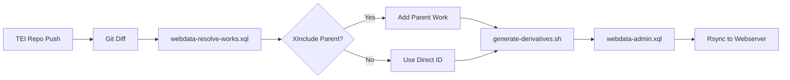

# Quadlet Configuration for Salamanca

This directory contains configuration files for running the Salamanca application stack using Podman Quadlet.

## Automated Generation from TEI Repository

### Architecture Overview

When TEI XML source files are updated in a separate repository, the CI/CD workflow:

1. **Detects changed files** via `git diff`
2. **Resolves work IDs** including XInclude parents (multivolume works)
3. **Generates derivatives** (HTML, TXT, PDF, RDF, IIIF)
4. **Offloads to webserver** via rsync



### XInclude Resolution Example

**Scenario:** User updates `works/W0066_Vol_02.xml`

**Parent Work TEI Structure (W0066.xml):**
```xml
<TEI xmlns="http://www.tei-c.org/ns/1.0" 
     xmlns:xi="http://www.w3.org/2001/XInclude" 
     xml:id="W0066">
  <teiHeader>
    <fileDesc>
      <titleStmt>
        <title>Multivolume Work Example</title>
      </titleStmt>
    </fileDesc>
  </teiHeader>
  <text type="work_multivolume">
    <group>
      <xi:include href="W0066_Vol_01.xml"/>
      <xi:include href="W0066_Vol_02.xml"/>
      <xi:include href="W0066_Vol_03.xml"/>
    </group>
  </text>
</TEI>
```

**Resolution Process:**
1. Git detects: `works/W0066_Vol_02.xml`
2. `webdata-resolve-works.xql` finds:
   - Direct ID: `W0066_Vol_02` (extracted from filename)
   - Parent work: `W0066` (found by searching for `<xi:include href="W0066_Vol_02.xml"/>`)
3. Generates derivatives for: **`W0066`** (the multivolume parent)

**API Call Example:**
```bash
curl "http://localhost:8080/exist/apps/salamanca/webdata-resolve-works.xql" \
  --data-urlencode "files=works/W0066_Vol_02.xml" \
  --data-urlencode "format=json"
```

**Response:**
```json
{
  "works": ["W0066"],
  "resolved": {
    "works/W0066_Vol_02.xml": ["W0066"]
  },
  "count": 1
}
```

Note: When a volume is updated, the entire parent work is regenerated to ensure consistency across all volumes.

### TEI Repository CI/CD Configuration

Create `.github/workflows/generate-derivatives.yml` in your TEI repository:

```yaml
name: Generate Derivatives

on:
  push:
    branches: [main]
    paths:
      - 'works/**/*.xml'
      - 'lemmata/**/*.xml'

jobs:
  generate:
    runs-on: ubuntu-latest
    
    steps:
      - name: Checkout TEI repository
        uses: actions/checkout@v4
        with:
          fetch-depth: 2
      
      - name: Detect changed TEI files
        id: changes
        run: |
          CHANGED=$(git diff --name-only HEAD^..HEAD | \
            grep '\.xml$' | \
            tr '\n' ',' | \
            sed 's/,$//')
          echo "files=$CHANGED" >> $GITHUB_OUTPUT
          echo "Changed files: $CHANGED"
      
      - name: Checkout svsal infrastructure
        uses: actions/checkout@v4
        with:
          repository: digicademy/svsal
          path: svsal
          token: ${{ secrets.GITHUB_TOKEN }}
      
      - name: Start generation services
        working-directory: svsal/docker
        run: |
          # Start existdb and any23
          docker-compose -f docker-compose.cicd.yml up -d
          
          # Wait for services to be ready
          timeout 300 bash -c "until curl -sf http://localhost:8080 >/dev/null 2>&1; do sleep 5; done"
          
          # Mount TEI source files into existdb
          docker cp $GITHUB_WORKSPACE/. \
            existdb-cicd:/exist/apps/salamanca-tei/
      
      - name: Generate derivatives
        working-directory: svsal/docker/scripts
        env:
          CHANGED_FILES: ${{ steps.changes.outputs.files }}
          EXISTDB_PASSWORD: ${{ secrets.EXISTDB_PASSWORD }}
          EXISTDB_URL: http://localhost:8080
        run: |
          chmod +x generate-derivatives.sh
          ./generate-derivatives.sh
      
      - name: Rsync to webserver
        env:
          SSH_KEY: ${{ secrets.SSH_PRIVATE_KEY }}
          WEBSERVER_HOST: ${{ secrets.WEBSERVER_HOST }}
          WEBSERVER_USER: ${{ secrets.WEBSERVER_USER }}
        run: |
          # Setup SSH
          mkdir -p ~/.ssh
          echo "$SSH_KEY" > ~/.ssh/id_rsa
          chmod 600 ~/.ssh/id_rsa
          
          # Get export volume path
          EXPORT_PATH=$(docker volume inspect existexport-cicd \
            --format '{{ .Mountpoint }}')
          
          # Rsync to webserver
          rsync -avz --delete \
            -e "ssh -o StrictHostKeyChecking=no" \
            "$EXPORT_PATH/" \
            "$WEBSERVER_USER@$WEBSERVER_HOST:/var/www/salamanca/webdata/"
      
      - name: Cleanup
        if: always()
        working-directory: svsal/docker
        run: docker-compose -f docker-compose.cicd.yml down -v
```

### Required Secrets

Configure in TEI repository Settings → Secrets:

- **`EXISTDB_PASSWORD`** - Admin password for eXist-db
- **`SSH_PRIVATE_KEY`** - SSH key for rsync to webserver
- **`WEBSERVER_HOST`** - Target server hostname
- **`WEBSERVER_USER`** - SSH username

### Manual Testing

Test the resolution locally:

```bash
# 1. Start services
cd docker
docker-compose -f docker-compose.cicd.yml up -d

# 2. Wait for services to be ready
timeout 300 bash -c "until curl -sf http://localhost:8080 >/dev/null 2>&1; do sleep 5; done"

# 3. Mount TEI source
docker cp /path/to/tei-files/. existdb-cicd:/exist/apps/salamanca-tei/

# 4. Test work resolution
curl "http://localhost:8080/exist/apps/salamanca/webdata-resolve-works.xql?files=works/W0066_Vol_02.xml"
# Returns: {"works": ["W0066"], "resolved": {...}}

# 5. Generate derivatives
export EXISTDB_PASSWORD="your-password"
export CHANGED_FILES="works/W0066_Vol_02.xml,works/W0013.xml"
./scripts/generate-derivatives.sh
```

### API Reference

#### `webdata-resolve-works.xql`

Resolves file paths to work IDs.

**Parameters:**
- `files` - Comma-separated file paths
- `format` - `json` (default) or `csv`

**Example:**
```bash
curl "http://localhost:8080/exist/apps/salamanca/webdata-resolve-works.xql" \
  --data-urlencode "files=works/W0066_Vol_02.xml,works/W0013.xml" \
  --data-urlencode "format=json"
```

**Response:**
```json
{
  "works": ["W0066", "W0013"],
  "resolved": {
    "works/W0066_Vol_02.xml": ["W0066"],
    "works/W0013.xml": ["W0013"]
  },
  "count": 2
}
```

#### `webdata-admin.xql` (Enhanced)

**New Parameters:**
- `wid` - Comma-separated work IDs or `"all"`
- `batch` - `true` for JSON output, `false` (default) for HTML
- `format` - Format to generate (html, txt, pdf, rdf, iiif, index, crumbtrails, details, snippets, nlp, routing, all)

**Example:**
```bash
curl -u "admin:password" \
  "http://localhost:8080/exist/apps/salamanca/webdata-admin.xql" \
  --data-urlencode "wid=W0066,W0013" \
  --data-urlencode "batch=true" \
  --data-urlencode "format=all"
```

**Response (HTTP 200/207/500):**
```json
{
  "results": [
    {"work": "W0066", "status": "success", "format": "all"},
    {"work": "W0013", "status": "success", "format": "all"}
  ],
  "total": 2,
  "successful": 2,
  "failed": 0,
  "runtime": "5.23 minutes"
}
```

#### `webdata-batch.xql` (Alternative Endpoint)

Simplified endpoint for batch processing.

**Parameters:**
- `works` - Comma-separated work IDs or `"all"`
- `formats` - Comma-separated formats or `"all"`

**Example:**
```bash
curl -u "admin:password" \
  "http://localhost:8080/exist/apps/salamanca/webdata-batch.xql" \
  --data-urlencode "works=W0066,W0013" \
  --data-urlencode "formats=html,txt,pdf"
```

**Response:**
```json
{
  "results": [
    {
      "work": "W0066",
      "formats": [
        {"format": "html", "status": "success"},
        {"format": "txt", "status": "success"},
        {"format": "pdf", "status": "success"}
      ]
    },
    {
      "work": "W0013",
      "formats": [
        {"format": "html", "status": "success"},
        {"format": "txt", "status": "success"},
        {"format": "pdf", "status": "success"}
      ]
    }
  ],
  "summary": {
    "totalWorks": 2,
    "totalOperations": 6,
    "successful": 6,
    "failed": 0,
    "formats": ["html", "txt", "pdf"],
    "runtime": "3.45 minutes"
  },
  "timestamp": "2024-01-10T16:00:00Z"
}
```

### HTTP Status Codes

- **200** - All operations successful
- **207** - Multi-Status (some operations succeeded, some failed)
- **500** - All operations failed

### Troubleshooting

#### Work not resolved

Check if the work exists in the TEI collection:
```bash
curl "http://localhost:8080/exist/apps/salamanca/webdata-resolve-works.xql?files=works/W0066.xml"
```

#### Generation fails

Check logs in the container:
```bash
docker logs existdb-cicd
```

#### TEI files not found

Verify TEI files are mounted:
```bash
docker exec existdb-cicd ls -la /exist/apps/salamanca-tei/works/
```

### Performance Considerations

- **Index first**: Always generate the index before other formats (`format=index`)
- **Parallel processing**: Consider splitting large batches across multiple workflow runs
- **Timeout**: Increase `TIMEOUT` environment variable for large works (default: 600 seconds)
- **Memory**: Adjust eXist-db memory in docker-compose (`JAVA_TOOL_OPTIONS: '-Xmx4g -Xms2g'`)

### Security

- **Secrets**: Never commit passwords or SSH keys to the repository
- **Authentication**: Always use authentication for derivative generation endpoints
- **Network**: Use private networks in production (not exposed ports)
- **Volume permissions**: Mount TEI source as read-only (`:ro`)
