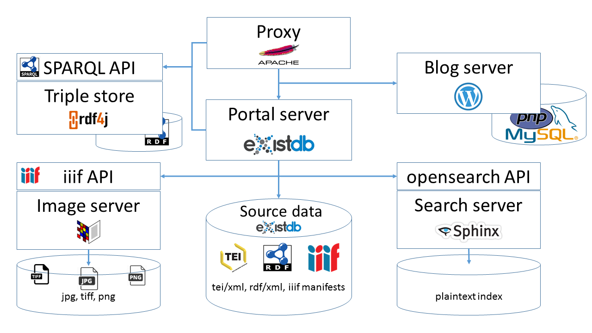

# The School of Salamanca - The Web Application, Technical Documentation

This is the core technical documentation for the web application "The School of Salamanca", available at <https://github.com/digicademy/svsal> and online at <https://www.salamanca.school/>.

## Parts and Services

The whole portal consists of several different services that are integrated in one UI:

1. An eXist-db database with xquery modules and xslt stylesheets
1. An eXist-db database with xml source files and derived rdf+xml and manifest files
1. A Wordpress instance for the blog (LAMP)
1. A Digilib image server for display of facsimile images
1. A Sphinxsearch search server, addressed via the open-sphinxsearch API (php)
1. For the time being a ftp webspace for other image downloads
1. A rdf4j triple store and SPARQL endpoint (which is momentarily down)
1. An any23 server used during extraction of rdf from TEI/xml (using [xtriples](https://github.com/digicademy/xtriples))

The User interface itself is plain HTML, with jquery, bootstrap and a few javascript addons. It is normally loaded by the user's browser contacting the main exist-db server.

### Fileserver / Data Repositories

Let's start with the hosting of source and derivative files. Besides the application server described below, we have isolated our source files to a separate repository. (At the moment, this is hosted as an independent eXist-db application on the main applications' server, but ideally, we could make it possible that it be hosted even on a different machine.) The so-called "svsal-tei" package comprises the digital collection's and dictionary's source files, divided into the following subcollections:

* authors
* lemmata
* meta (holds files with general and technical information, partially being xincluded in the works xml files)
* workingpapers
* works

For ease of deployment, derivative data (such as rdf and iiif files) are stored in a separate "svsal-webdata" package, which currently contains the following subdirectories:

* corpus-zip (hosting all files of the collection's corpus in a specific format, such as txt or TEI xml, in compressed form)
* html
* iiif
* index (containing registers of nodes in the TEI files, which foremost are used internally for data processing and querying)
* rdf
* snippets (for Sphinxsearch)
* stats (json files containing statistical data for single works as well as for the complete corpus)
* txt (plain text files for works)

In fact, throughout the application, these folders/collections are addressed via the following variables, defined in _modules/config.xql_:

* `$config:tei-root`
  * `$config:tei-authors-root`
  * `$config:tei-lemmata-root`
  * `$config:tei-workingpapers-root`
  * `$config:tei-works-root`

and

* `$config:webdata-root`
  * `$config:iiif-root`
  * `$config:rdf-root`
  * ...

### Main server application

(Almost all of the application's configuration happens at _modules/config.xqm_, however it will not be covered in one isolated place but rather in the respective context where settings play their roles.)

When a request arrives at the eXist-db service (more exactly, at the jetty service who is configured to forward it to the eXist-db applet), it is being handled by the central _controller.xql_ xquery file in the svsal app. The controller then routes the request, deciding which piece of code should handle it. This can happen based on a couple of factors: server or path components (like in <https://api.salamanca.school/codesharing/codesharing.html>), filename extensions (like in <https://www.salamanca.school/iiif-out.xql?wid=W0014>), full resource names (like in <https://www.salamanca.school/favicon.ico> or <https://www.salamanca.school/robots.txt>) or a content negotiation mechanism (like in <https://id.salamanca.school/works.W0015:p23>).

While most of the requests for *.html files are forwarded to _modules/view.xql_, we forward a couple of them to _modules/view-admin.xql_ which does the same rendering job of merging html with db requests and functions (see below) except it also sources _modules/admin.xqm_ so that the functions in that file are accessible from the admin html files.

#### Preparing Sources

The preparation of the primary research (TEI) data happens elsewhere and has not yet been open-sourced, although an open source publication and development of the text preparation apparatus is planned for the future.

#### Creation of "Webdata"

In this context, the term "webdata" refers to different types/formats of secondary research data, i.e. data that are derived from the primary TEI research data (see above).

The creation of webdata happens by means of dedicated xquery modules that largely reside in the "modules/factory/works/" directory. These modules offer public functions that can be evoked for creating HTML fragments (see the html.xqm in the respective directory), plain text version (txt.xqm), IIIF manifests (iiif.xqm), or statistics (stats.xqm), among others. The triggering of these functions is possible through the admin interface (admin.html in the app root) and a gateway query module (webdata-admin.xql) that consumes certain parameters (like work id and format) and then calls the respective admin functions in the modules/admin.xqm module (which, in turn, calls functions in the factory modules mentioned above). The gateway query module webdata-admin.xql can also be called directly (given that the user has database admin rights) if the specific parameters and values are known. In any case, the chain of library and query function calls facilitates a suitable separation of concerns as well as logging mechanisms for different levels of specificity, which is convenient as, especially for larger works, the creation of webdata can be time-consuming and difficult to debug.

An exception to this is the way of deriving rdf (xml) data: while this also happens via the admin module chain, the ultimate call from the admin.xqm does not target a function in the modules/factory/works module space, but makes an http GET request to a dedicated XTriples webservice that is embedded into the web application, which then extracts rdf triples from the respective TEI data. 

When data have finally been computed, they are automatically stored in the svsal-webdata package (see above) through the admin.xqm module.

#### Node Indexing

A crucial part in the derivation of webdata is the creation of so called node indexes. These indexes hold basic information about all relevant nodes in the tei:text section of a work's TEI dataset, such as a node's xml:id, it's name and type, it's hierarchical context, and a mapping to the HTML fragment in which the (transformed) node can later be found in the reading view. This information plays a central role in the functioning of the app (e.g., in the production of crumbtrails in the search results view), but it also is the point of origin for the creation of further webdata formats such as html fragments (which require mappings between TEI nodes and HTML fragments in the first place, for instance) or RDF data. Because of that, the first step in the creation of webdata for a (new) work always is the node indexing, and only then further webdata can be created safely.

The generation of index data can be time-consuming with larger works and may itself produce larger datasets with several thousands of nodes. The core functionality for computing index nodes resides in the modules/factory/works/index.xqm module.

Over time and with increasing amounts of heterogeneous TEI data to be processed, it became clear that it is necessary, on the one hand, to index nodes and their types in a "flexible" way that is capable of dealing with new and unexpected TEI structures, but, on the other hand, that the indexing must be sufficiently systematic for other modules (for the creation of further webdata and in the app core) to treat TEI nodes in a unified manner. For this, the following generic node categories have been identified:
- _structural nodes_ are nodes that occur in the upper hierarchical layers of a `tei:text` and represent larger structural units, such as `tei:frontmatter`, `tei:body`, `tei:back`, and `tei:div`;
- _main nodes_ are nodes that represent lower-level text containers, such as `tei:p`, `tei:head`, or `tei:lg` (as long as they do not occur within lists, see the _list_nodes_ below);
- _list nodes_ are container nodes that are themselves lists (`tei:list`) or occur within `tei:list` (such as `tei:item`, `tei:head`, but also nested `tei:list`);
- _marginal nodes_ are nodes representing marginals, such as `tei:note[@place eq 'margin']` or `tei:label[@place eq 'margin']`; _marginal nodes_ usually occur within _main nodes_, but not vice versa;
- _page nodes_ and _anchor nodes_ are lowest-level nodes representing pages (`tei:pb`) and citation anchors (`tei:milestone`), respectively.

The sum of all these nodes represents the nodes to be indexed (i.e., and index node is in exactly one of the categories above). However, indentifying the node type is important not only for determining whether some TEI node is to be indexed, but plays a crucial part in providing the node with further information during indexing: it's specific "citetrail" (the individual string for the node that is used to create permalink URIs); it's "passagetrail" (the non-technical, verbose information about the context of the node that is used for citation proposals, for instance); or it's "crumbtrail" (used for the hierarchical displaying of links to text units in search results, for example).

Node categories are defined using boolean functions which, by means of XPath expressions, check whether a node is of the specific type. For example, a function defining _marginal nodes_ might look like this:

`
declare function index:isMarginalNode($node as node()) as xs:boolean {
    boolean(
        $node/@xml:id and
        (
            $node/self::tei:note[@place eq 'margin'] or
            $node/self::tei:label[@place eq 'margin']
        )
    )
};
`

If no such function returns true for a TEI node, then the node will not be indexed. Also, it is important that the definitions of nodes do not overlap, i.e. a `tei:note[@place eq 'margin']` must not be a _marginal node_ and a _main node_ (for example) at the same time. 

Overlapping with the above-mentioned, rather hierarchically defined node categories (a _main node_ is embedded within a _structural node_, etc.) is a further type of category, the so called _basic nodes_, that represent a sequence of basic text containers in a text. The necessity for this category was given particularly due to the creation of snippets for the Sphinx search engine, which requires a non-hierarchical, strict sequence of non-overlapping textual snippets for correctly indexing a text; if two such snippets were overlapping (for example, a _structural node_ and a _main node_ embedded within the former), some parts of the text (in the example, the _main node_) would be indexed twice and the search would finally return duplicate results. Thus, _basic nodes_ are low-level containers (basically, all _main nodes_ and _marginal nodes_, but also some low-level _list_nodes_) and are not an addition to the categories defined above, but rather a specification of some of them.

The following graphic illustrates the different types of nodes: 

If a new node (e.g., a new TEI element that was hitherto not defined as index node) is to be added to the node indexing procedure, the following steps are necessary:
1. determine which category of node the new node shall be part of (e.g., _main node_);
2. in the respective function (e.g., `index:isMainNode`), add a section for the new node to the XPath expression, so that the function does recognize the node as "one of its kind"; by doing so, the node is also recognized as a general index node;
3. check if there is a function for the respective element defined in the index.xqm (usually named `index:[ELEMENT NAME]()`); if this is the case, you might need to adjust the function; if there is no such function, you will need to add one in order for the new node's information (citetrail, passagetrail, etc.) to be processed correctly;
4. do the same as in 3. with modules for other webdata such as html.xqm or txt.xqm, and also with the configuration file for the xtriples webservice (in services/lod/svsal-xtriples-work.xml) – that is, wherever TEI elements are processed individually.

There might be more (specific) adjustments to be done, e.g. in functions like `index:isNamedCitetrailNode` (determining the kind of citetrail part for a node) or `index:isPassagetrailNode` (determining whether a node is explicitely mentioned in a passagetrail), but a lack of adjustment (or an erroneous configuration, for that matter) will perhaps be revealed through errors in the process of computing the webdata. 

##### Rendering HTML

##### Rendering search snippets

##### Creating iiif manifest files

##### Creating rdf triples

#### Viewing

#### Searching

### Search server
