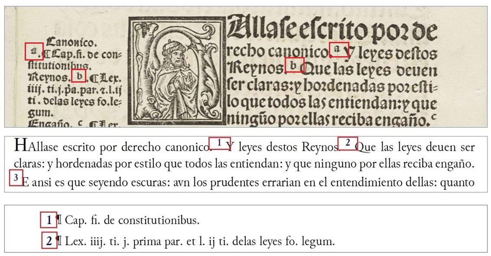
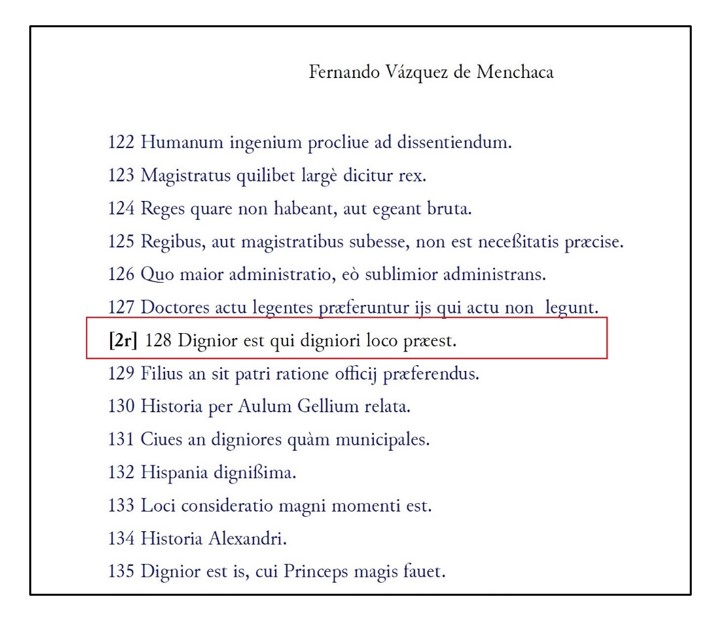
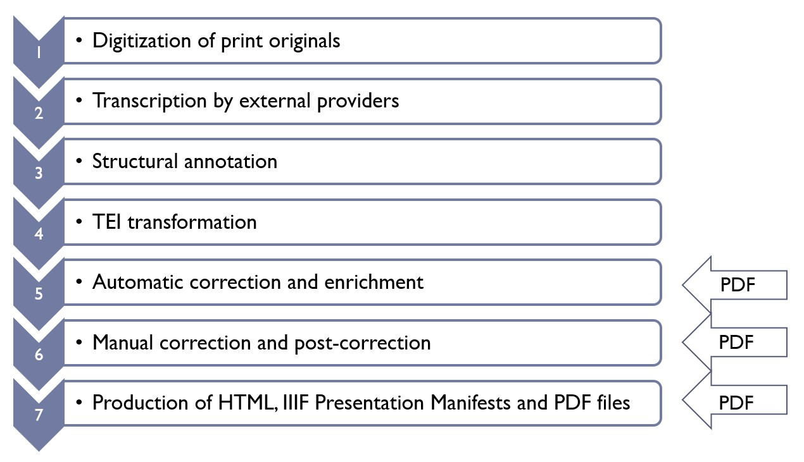

# Data quality: the added value of printing digital editions\[1]

### Introduction

Print output—along with HTML and ePub—is one of the ways to visualize information encoded in TEI XML files.\[2] There is no reliable statistics as to what percentage of currently more than 800 existing scholarly digital editions (SDEs) can be given in print. Sahle’s extensive list of SDEs, comprised of 823 entries, does not contain a search criterion for print output.\[3] A much smaller ACDH’s catalogue of digital editions, containing 320 entries, refers to a “printer-friendly” feature present in 100 editions.\[4] The relative infrequency of print output can be explained by the fact that SDEs, being a product of a digital paradigm, “cannot be given in print without significant loss of content and functionality” (Sahle 2017). This applies, however, to any visual representation of the encoded data: HTML, LaTeX, PDF, and even a searchable database deliver only an excerpt of the information available in a raw dataset. Yet rendering information in the two-dimensional space of the print page entails another important aspect – it serves as a data quality assurance method, assisting the static ODD, Relax NG, and XML Schemata routines.

The need for extensive quality methods comes to the fore with the increase of research data produced by social sciences and humanities. Several research projects have assigned specific teams to tackle the task of standardizing the continuous quality management. The task area “Standards, Data Quality and Curation” within the German NFDI4Culture consortium aims “to develop and establish recognized standards and procedures for quality assurance of research data in academic fields that deal with tangible and intangible cultural assets”.\[5] A demanding task of modelling and classifying the quality problems in data, data models and data transformations, representing the objects of material culture, has been set by the Konda project in the Göttingen State and University Library\[6]. The project works on expanding LIDO, the XML-based Lightweight Information Describing Objects standard, which supports the full range of descriptive information about museum objects\[7].

Data production is in fact a process of a continuous validation, correction, and improvement, involving static and dynamic quality procedures. XML data can be statically controlled by ODD, Relax NG, and XML Schemata and dynamically by custom Python, R and Schematron scripts. This article addresses a rather unconventional way of testing the TEI XML data, namely by applying the XSLT transformation scenarios for print output.

### The School of Salamanca project

The project "The School of Salamanca. A digital collection of sources and a dictionary of its juridical-political language" is jointly sponsored by the Academy of Sciences and Literature | Mainz, Max Planck Institute for Legal History and Legal Theory and Goethe-University Frankfurt am Main\[8]. It publishes the works of jurists and theologians affiliated with the University of Salamanca—the intellectual center of the Spanish monarchy during the 16th and 17th centuries. Based on a selected set of print editions we create a digital text corpus, which will contain 116 works, with more than 108 000 printed pages of Early Modern Latin and Spanish texts encoded in TEI XML. In addition, we also compose a historic dictionary of approximately 300 essential terms, rendering the importance of the School of Salamanca for the early modern discourse about law, politics, religion, and ethics.

Currently 36 works have completed the production cycle which includes HTML export for online access and full-text search, IIIF Image and Presentation manifests, RDF and TXT export. Recently, the PDF output option was also added, and it had a direct impact on Salamanca’s workflow and quality control. It is now implemented early during TEI production as a diagnostic tool, displaying semantic and structural inconsistencies of the data.

#### Production workflow

Salamanca’s production workflow consists of a number of sequential steps, which are familiar to those creating scholarly digital editions\[9]. It bears similarities to the “waterfall” method of the software development, where each phase must be completed before the next one can begin (Petersen, Wohlin, and Baca 2009):

Figure . The School of Salamanca's “waterfall” production workflow

1. The first step is the digitization of the print originals held by the libraries worldwide. It includes the compilation of the XML header with bibliographic metadata and publication of the facsimiles on the IIIF server.
2. It is followed by the transcription, conducted in TEI Tite format by the external providers. TEI Tite, in contrast to the generic TEI All schema, has a reduced, compact vocabulary.
3. The TEI Tite files upon arrival undergo the manual structural annotation, cross-referencing and resolution of unclear marks.
4. Only after that the text is automatically transformed into a project-specific TEI. The resulting document contains the metadata in \<teiHeader>, and all elements and attributes adapted to TEI-All.
5. TEI transformation is followed by a sequence of automatic corrections and enrichment routines, driven by XSLT templates. They apply to the annotation of hyphenated words, abbreviations and special characters resolution and xml:id tagging.
6. Then texts go to the manual correction and post-correction, where the remaining transcription and typographical errors are resolved.
7. The final step is the production and delivery of the derived data formats taking place in the Exist DB. These are HTML pages, IIIF manifests, Search index and crumb trails, plaintext, RDF and PDF files.

#### XSL Formatting Objects

The existing frameworks for the creation of digital editions, such as TEI Publisher\[10], TEI-CAT\[11] or Stylo\[12], come with an option of different export formats. Considering the complexity and the depth of Salamanca’s annotation, we opted for the custom production workflow, integrating the established XSL-FO technology for PDF export. Although the latest XSL-FO 1.1 specification dates back to 2006\[13], this format is still widely used. The reasons might lie in the free Apache FOP processor (included, for example, in Oxygen XML Editor), while its current replacement CSS Paged Media is proprietary\[14]. The latest Apache FOP 2.8 was released in November 2022; its commercial counterparts supporting XSL-FO, such as RenderX XEP Engine\[15] and Antenna House Formatter\[16], are also regularly updated. At Salamanca we made some preliminary tests with XSL-FO in 2018, and when the production started in 2021, we adopted and upgraded the existing templates\[17].

#### Book components

In the Formatting Objects routine, the original XML is transformed to XSL-FO document which is then picked up by the Apache FO Processor and converted to PDF. Salamanca’s generic transformation rules apply to 36 released works and render them in print as close to the original as possible. The line and page breaks in PDF edition are different from the original; the original page numbers are inserted in square brackets in the text flow (these may also be added if missing in the original). Our template defines nine book components related to the abstract „page masters” in XSL-FO template.

The first component is the so-called “Half title“ (German _Schmutztitel_), containing the short title of the work and the name of its author. The second is the “Frontispiece”, rendering the scan of the title page of the original.

Figure . Half title and frontispiece

These are followed by the title page of the digital edition and the edition notice.

Figure . Title page of the digital edition and edition notice.

After that the book contents per se are delivered. First comes the title page of the original generated from \<titlePage>.

Figure . Title page of the original

The introduction section renders the \
 elements of \<front> and is followed by the contents of \<body>.

Figure . Introduction and main sections (\
/\<front> and \<body>).

The eighth section shows the contents of \<back>.

Figure . Concluding section (\<back>)

If the original contains marginal notes, they are published in the final section of the book as end notes.

Figure . Marginal notes rendered as end notes.

The generic XSL-FO template allows duplicating and removing components dynamically, when, for example, the original has two title pages (one of the volume series and one of the current volume), or the introduction section is missing and pagination should start from \<body>.

The canons of Western book page design place the center of the text area above the center of the page and define the gutter margin narrower than the fore-edge margin (Antenna House 2019: 21–22). As our PDF publication is supposed to be printed or viewed as A4 pages (height="29,7 cm" width="21,0 cm"), we simplified this layout: the distance to the text on the left and right is equal (3,0 cm), on top it measures 5,1 cm and at the bottom—3,6 cm. The XSL-FO page masters prescribe three types of margins on each side, two of which are not printable and remain empty, and another one which contains a header and a footer. Below is a schematic layout of the page with the dimensions of the margins:

Figure . Salamanca's print edition page layout.

Salamanca’s XSL-FO template defines the print area as a one-cell table whose borders are deactivated. We activate them in debugging sessions to control the margins and other layout features.

### PDF export as a diagnostic tool

The “School of Salamanca” project implements stringent data quality control checks after each production step. The results of structural annotation (step 3) are controlled by TEI Tite Relax NG schema; TEI transformation and correction steps are monitors by the corresponding Relax NG and Schematron files. PDF generation proved to be an additional quality assurance methods, revealing XML issues belonging to such diverse areas as the order and the position of XML elements, cross-referencing, character encoding, text markup, etc. (cf. Kesper et al. (2020)). The errors discovered can be described in terms of three quality dimensions, rendering the interaction of three elements – the original, the TEI XML code and the print edition ):

Figure Three components inducing three types of error dimensions

* _Internal_ dimension pertains to the semantic and syntactic accuracy of XML code and its compliance with the adopted data models and schemata.
* _External_ dimension applies to the consistency of the print output in rendering the original edition (the one being retro-digitized). The TEI XML cannot encode all features of the original, but the conventions chosen should be coherent.
* _Contextual_ dimension is induced by the interaction of TEI XML with the transformation scenarios. It does not necessarily signal mistakes in the source code but shows its discrepancy with the desired output.

Retro-digitized SDEs possess all three dimensions, while originally digital SDEs lack the external quality dimension. Stein and Taentzer (2023) assign such data quality features as accuracy, completeness, conciseness and consistency to the internal dimension, while accessibility, currency, plausibility, traceability and understandability are treated as contextual. The following examples will demonstrate, however, that these features (for example, consistency) stretch over all layers of data quality.

#### Consistency of XML encoding

Among the errors related to the consistency of the encoding two cases can be singled out:

* _An XML element is not rendered in PDF output._ This can be triggered by a new XML element, not yet known to the template, which contains either a new type of information or a known information type was encoded differently (internal dimension). A contextual variant of this mistake appears when a known information type is printed in the wrong place. This occurs when the template rules prescribe a fixed order of elements, while they may vary from volume to volume:

Figure A wrong position of an element induced by a prescriptive template.

* _Similar XML elements are rendered differently_ in the print edition. PDF export visualizes the semantics of the encoding – the aspect which is not controlled by the XML Schemata and Schematron. In the following example two functionally identical passages are displayed differently, because the second one was mistakenly marked as a header in XML (external dimension).

Figure Inconsistent encoding of semantically identical text parts

PDF delivers a constituted version of Salamanca TEI, meaning that selected special characters and abbreviations are expanded. We display the standardized versions of characters such as Latin ⁊ (et) and Latin ſ (long s). In addition, Latin, Greek, Hebrew, and Arabic characters occur and need special fonts to be rendered properly. PDF helps to control the homogeneous reproduction of text parts marked in the original as capitalized, italicized, with superscript, initials, different font sizes, etc.

Figure An error signaling that the difference in font size is not encoded in XML.

#### Marginal notes and milestones

A particular case of interaction between the internal dimension of XML encoding and its external representation are marginal notes and milestones. Marginal notes in Salamanca’s sources usually contain two components – an anchor in the text and a note body itself. Anchors can be alphabetical, numerical, or expressed with a symbol:

Figure Marginal notes with alphabetical anchors.

Sometimes anchor is missing in the main text, and note is located next to the line it refers to. In XML this corresponds to the position before the \<lb> element. The number of marginal notes in one document can be up to 8,000.

Figure Encoding of a non-anchored marginal note in XML.

A substantial difficulty in displaying non-anchored marginal notes in print is conditioned by the fact that in the original they float alongside the main text. Their position is marked in XML by line beginning (\<lb>), which does not correspond to the line beginning in PDF output. Apache FO processor has insufficient support for floats, and the formatters which interpret them, such as Antenna house or RenderX, are proprietary. Considering this, we decided to unify the representation of anchored and unanchored notes – they all get a numerical mark and an anchor in the main text in PDF. In addition, we place all the notes as endnotes in a separate section, creating cross-references between them and anchors.

Figure Rendering of marginal notes as endnotes in PDF.

Milestones mark sections of text not represented by structural elements. They are encoded in a way similar to marginal notes with an anchor in text and a related mark on the margin, usually an Arabic number. In addition, they are frequently cross-referenced from an item in summary they are related to.

Figure Milestones in text and the items in the summary they are linked to.

PDF export highlighted a particular aspect of encoding non-anchored marginal notes and milestones, situated at line end containing a word break. In the print output the anchor appeared in the middle of the word.

Figure Marginal note or milestone appearing at word break in the original.

This bug has two dimensions – an internal convention chosen to encode non-anchored marginal notes and milestones and the external representation of this convention in PDF. Unless floats are supported by the selected formatter, marginal notes and milestones should be coded in TEI not at word break, but before or after the word they refer to. This case pointed at the importance of data visualization already during the phase of data modeling and design.

#### Cross-referencing

PDF export delivers handy templates for copy-editing and proofreading. It can be used for checking the cross-references, which missed the attention of XML schemata. In an example below the item in the “Summary” is lacking cross-reference, because the milestone it refers to has a wrong number. This is a collateral bug of another improvement, which has taken place after the Schematron check:

Figure Missing cross-reference.

A missing cross-reference may occur when linking is made to an external document, not included in the current publication. The actual design of a reference is another semantic feature which can be tested – namely, which part of the string should serve as an anchor? In the example below two different conventions were chosen for referencing the section of the book from its summary.

Figure Inconsistent cross-referencing from the section title.

### PDF impact on data quality assurance

At Salamanca the steps of the production pipeline are executed sequentially, in a waterfall model, where the output of each stage is validated by the respective schemata. The PDF generation was initially intended as of the export methods of the TEI data, located at the very end of the product development. As soon as it was implemented, we realized that this type of data visualization can be used as a diagnostic method to expose semantic and structural discrepancies in the source data. We therefore moved PDF export up the workflow, implementing it after three last steps of TEI production:

Figure PDF export in the production workflow.

This application of PDF print bears similarity to the so-called Agile development method. In Agile the software product is built in small progressive chunks, and each of the development cycles includes feature clarification, design, coding, and testing. It is conducted by cross-functional teams of people who house a range of expertise including programming, testing, analysis, database administration, user experience and infrastructure (Black 2017: 7) .

Figure Waterfall vs. Agile development methods. Source: https://www.researchgate.net/publication/320775359\_Applied\_Visual\_Metaphors\_in\_Organizational\_Management/figures?lo=1

PDF creation adheres to the principles of Agile software testing, which state that capturing and eliminating defects in the early stages of software development is less time-consuming, less resource-intensive and less prone to collateral bugs (Crispin 2008). It does not only start early in the data development and repeats with every subsequent step. It assists data quality assurance in two ways: on the one hand, it raises formal errors in the code and on the other hand—it facilitates manual corrections by providing a new optical impression of the data.

The three types of error dimensions given above, render the complexity of an error definition in the context of scholarly digital editions. In the software world “bug” is a deviation from the desired behavior defined by the software specification (Crispin 2008: 416). The descriptive nature of XML-based SDEs includes elements of ambiguity and interpretation (Wenz, Kesper, and Taentzer 2022). The identification of an error thus requires a skill set different from that of a traditional software tester. In fact, it suggests that researchers should take over the task of software testers in social sciences and humanities projects. Researchers are used to deal with uncertainty, where not the software specification, but the knowledge of the study subject and the depth of its analysis are instrumental in distinguishing a “bug” from a “feature”. Engaging researchers as testers breaks the traditional boundary between the scientific and coding teams of the SSH project staff: in this way the former provide the direct feedback to the latter and thus actively participate in the development process. These two aspects—the fuzziness of an error and a researcher skill set required from a tester—are the salient features of quality assurance in digital social sciences and humanities distinguishing it from the conventional QA.

**Keywords**

Digital Editions, PDF Export, Print, XSL-FO, Agile, Data Quality Assurance, Software Test.

**Table of figures**

Figure 1. The School of Salamanca's “waterfall” production workflow 3

Figure 2. Half title and frontispiece 4

Figure 3. Title page of the digital edition and edition notice. 5

Figure 4. Title page of the original 5

Figure 5. Introduction and main sections (\<tei:div>/\<tei:front> and \<tei:body>). 6

Figure 6. Concluding section (\<tei:back>) 6

Figure 7. Marginal notes rendered as end notes. 7

Figure 8. Salamanca's print edition page layout. 8

Figure 9 Three components inducing three types of error dimensions 9

Figure 10 A wrong position of an element induced by a prescriptive template. 10

Figure 11 Inconsistent encoding of semantically identical text parts 11

Figure 12 An error signaling that the difference in font size is not encoded in XML. 12

Figure 13 Marginal notes with alphabetical anchors. 13

Figure 14 Encoding of a non-anchored marginal note in XML. 13

Figure 15 Rendering of marginal notes as endnotes in PDF. 13

Figure 16 Milestones in text and the items in the summary they are linked to. 14

Figure 17 Marginal note or milestone appearing at word break in the original. 14

Figure 18 Missing cross-reference. 15

Figure 19 Inconsistent cross-referencing from the section title. 15

Figure 20 PDF export in the production workflow. 16

Figure 21 Waterfall vs. Agile development methods. Source: https://www.researchgate.net/publication/320775359\_Applied\_Visual\_Metaphors\_in\_Organizational\_Management/figures?lo=1 17

**Bibliography**

Antenna House. 2019. _Introduction to CSS for Paged Media_. Newark, Delaware.

Black, Rex, ed. 2017. _Agile Testing Foundations: An ISTQB Foundation Level Agile Tester Guide_. Swindon, UK: BCS, The Chartered Institute for IT.

Crispin, Lisa. 2008. _Agile Testing: A Practical Guide for Testers and Agile Teams_. 1st ed. Upper Saddle River, NJ: Addison-Wesley Professional.

Kesper, Arno, Markus Matoni, Julia Rössel, Michelle Weidling, and Viola Wenz. 2020. “Catalog of Quality Problems in Data, Data Models and Data Transformations.” https://doi.org/10.5281/zenodo.3955500.

Petersen, Kai, Claes Wohlin, and Dejan Baca. 2009. “The Waterfall Model in Large-Scale Development.” In _Product-Focused Software Process Improvement_, edited by Frank Bomarius, Markku Oivo, Päivi Jaring, and Pekka Abrahamsson, 386–400. Lecture Notes in Business Information Processing. Berlin, Heidelberg: Springer. https://doi.org/10.1007/978-3-642-02152-7\_29.

Sahle, Patrick. 2017. “2. What Is a Scholarly Digital Edition?” In _Digital Scholarly Editing : Theories and Practices_, edited by Matthew James Driscoll and Elena Pierazzo, 19–39. Digital Humanities Series. Cambridge: Open Book Publishers. http://books.openedition.org/obp/3397.

Stein, Regine, and Gabriele Taentzer. 2023. “How to Define the Quality of Data and Data Models? A Perspective from the Cultural Heritage Domain.” https://doi.org/10.5281/zenodo.7705014.

Wenz, Viola, Arno Kesper, and Gabriele Taentzer. 2022. “Classification of Uncertainty in Descriptive Data Representing Scientific Knowledge.” https://doi.org/10.5281/zenodo.6327011.

1. This article is based on the talk given at TEI Consortium and Members meeting 2022 in Newcastle, released on Zenodo: [https://doi.org/10.5281/zenodo.7594028](https://doi.org/10.5281/zenodo.7594028). I would like to thank my colleagues at the “School of Salamanca” project Dr. Andreas Wagner and Dr. Marie-Astrid Huegel for providing valuable feedback on the text of the talk. ↑
2. Print output is understood here as a transformation scenario applied to the original XML files with PDF as outcome. Its goal is to render XML as close as possible to the original. This procedure should be distinguished from the “print-friendly” view of digital editions, produced by applying CSS media types to (X)HTML pages. ↑
3. [https://www.digitale-edition.de/exist/apps/editions-browser/index.html](https://www.digitale-edition.de/exist/apps/editions-browser/index.html), accessed on 27.03.2023. ↑
4. [https://dig-ed-cat.acdh.oeaw.ac.at/](https://dig-ed-cat.acdh.oeaw.ac.at/), accessed on 27.03.2023. ↑
5. [https://nfdi4culture.de/what-we-do/task-areas/task-area-2.html](https://nfdi4culture.de/what-we-do/task-areas/task-area-2.html), accessed on 20.03.2023. ↑
6. [https://www.sub.uni-goettingen.de/en/projects-research/project-details/projekt/konda/](https://www.sub.uni-goettingen.de/en/projects-research/project-details/projekt/konda/), accessed on 20.03.2023. ↑
7. [https://cidoc.mini.icom.museum/working-groups/lido/lido-overview/about-lido/what-is-lido/](https://cidoc.mini.icom.museum/working-groups/lido/lido-overview/about-lido/what-is-lido/), accessed on 20.03.2023. ↑
8. [https://www.salamanca.school/en/index.html](https://www.salamanca.school/en/index.html) ↑
9. The detailed description of the workflow is given by Cindy Rico Carmona in Salamanca’s blog: [https://blog.salamanca.school/en/2022/04/27/the-school-of-salamanca-text-workflow-from-the-early-modern-print-to-tei-all/](https://blog.salamanca.school/en/2022/04/27/the-school-of-salamanca-text-workflow-from-the-early-modern-print-to-tei-all/) ↑
10. [https://teipublisher.com/index.html#features](https://teipublisher.com/index.html#features), accessed on 20.03.2023. ↑
11. [http://teicat.huma-num.fr/](http://teicat.huma-num.fr/), accessed on 20.03.2023. ↑
12. [http://stylo-doc.ecrituresnumeriques.ca/en\_EN/#!pages/about.md](http://stylo-doc.ecrituresnumeriques.ca/en\_EN/#!pages/about.md), accessed on 20.03.2023. ↑
13. [https://www.w3.org/TR/xsl/#fo-section](https://www.w3.org/TR/xsl/#fo-section) , accessed on 20.03.2023. ↑
14. [https://xmlgraphics.apache.org/fop/](https://xmlgraphics.apache.org/fop/), accessed on 20.03.2023. ↑
15. [https://www.renderx.com/tools/xep.html](https://www.renderx.com/tools/xep.html), accessed on 20.03.2023. ↑
16. [https://www.antennahouse.com/formatter-v7](https://www.antennahouse.com/formatter-v7), accessed on 20.03.2023. ↑
17. The PDF output of the TEI XML files can be found in Salamanca’ Github repository, along with the detailed description of the XSL-FO Template: [https://github.com/digicademy/svsal/tree/master/xslt-fo-pdf](https://github.com/digicademy/svsal/tree/master/xslt-fo-pdf). ↑
